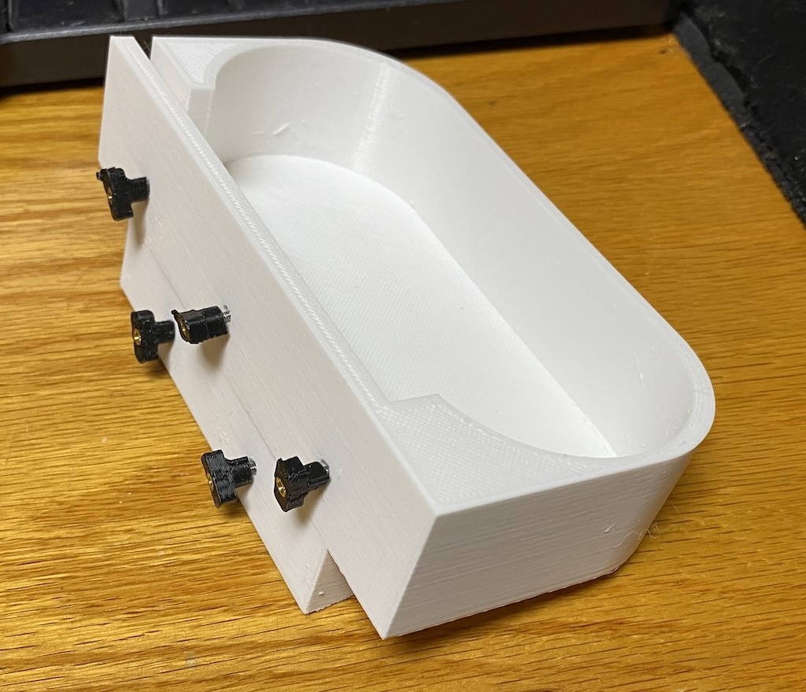
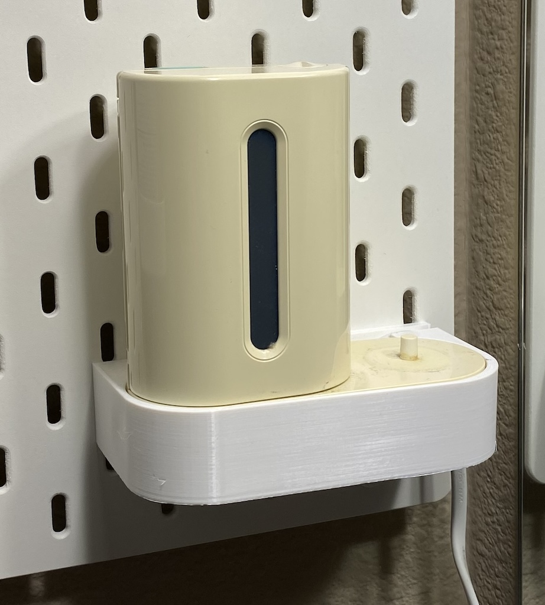

SKÅDIS mount for Philips Sonicare UV Toothbrush Santizer & Charger, model HX6160/D

Designed to use the T-Nuts Mounting System, I used the [M2 Heat set version](https://www.printables.com/model/461307-skadis-t-nuts-mounting-system-for-ikea-skadis-pegb)

Use 12mm M2 bolts with a washer. You may not need to use all five bolts.

After printing, with T-Nuts attached:

Installed:

